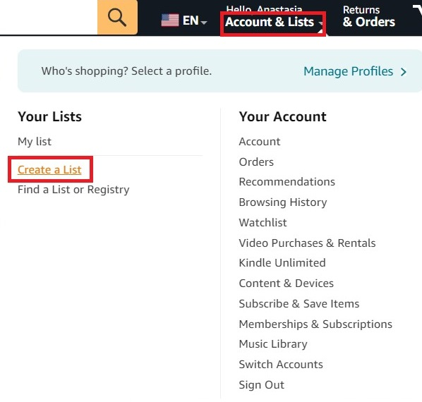
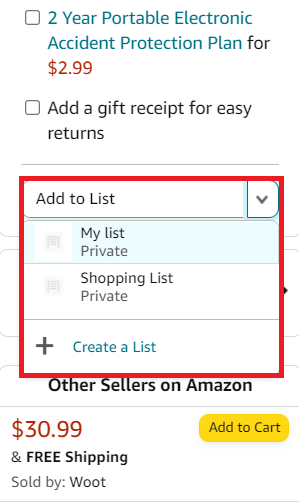
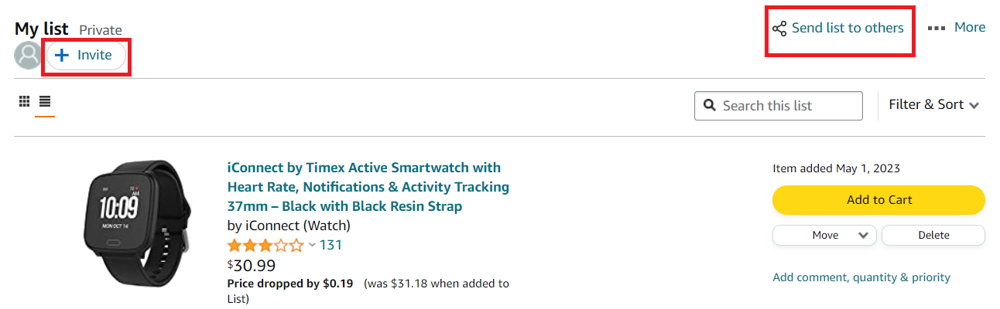
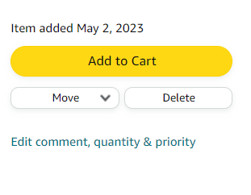
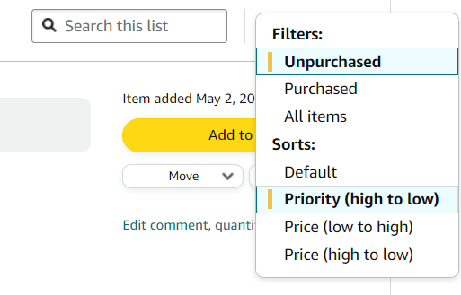
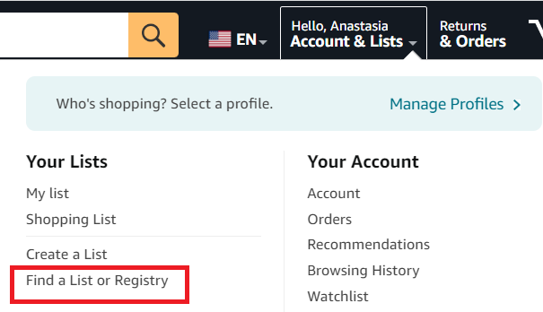

# Amazon wish lists

Amazon wish lists allow you to keep track of the items you wish to buy.
You can also use lists as a gift registry to share with family and
friends. Once an item on the list is purchased, this item is labeled as
such, so you won't receive multiples.

## Create a list

1. On your Amazon home page, hover over **Accounts & Lists**. 
2. In the **Your Lists** menu, click **Create a List**.

   <table><tr><td>
   
   </td></tr></table>

3. In the **Create a new list** dialog, name your list and click **Create
list**.

## Add items to your list

You can add items to your list from a product page.

- In the **Add to list** drop-down menu on the left of the product page,
select an existing list or create a new one.
   
   <table><tr><td>
   
   </td></tr></table>

The item is added to the selected list.
 
## Share your list

1.	On your Amazon home page, hover over **Accounts & Lists**. 
2.	In the **Your Lists** menu, select the necessary list.
3. To share the list, select one of the following:

   - **Invite**
   - **Send list to others**

      <table><tr><td>
   
   </td></tr></table>

4. Set the settings: 

   - Select **VIEW ONLY** if you don't want other people to edit your list.
   - Select **VIEW AND EDIT** if you would like others to add and remove items from
your list. 

5. To share your list select one of the following:
   - **Copy link** 
   - **Invite by email**

## Manage your list  

1. Open your list and select **More > Manage list**. 
2. Specify the following parameters:

   | Name                                    | Function                                                                                                                                                             |
   |:-----------------------------------------|:----------------------------------------------------------------------------------------------------------------------------------------------------------------------|
   |     **List name**                           |     Edit the name of   your list.                                                                                                                                    |
   |     **Privacy**                             |     Set the privacy status to **Public**, **Shared**, or **Private**.                                                                                                            |
   |     **Manage list with Alexa**              |     Choose if items can be added to   your list through Alexa.                                                                                                       |
   |     **List is for**                         |     Choose if the list is for you or   for an organization.                                                                                                          |
   |     **Recipient**                           |     Type in the name of the   recipient. Your name is used by default.                                                                                               |
   |     **Email**                               |     Type in the recipient’s email.                                                                                                                                   |
   |     **Birthday**                            |     Select the recipient’s birthday   in the drop-down menus.                                                                                                        |
   |     **Description**                         |     Briefly describe the purpose of   the list and/or provide some information about the recipient.                                                                  |
   |     **Shipping Address**                    |     Either select your existing   shipping address in the drop-down menu or create a new address.                                                                    |
   |     **Keep purchased items on the list**    |     Select if you don’t want items to   be automatically removed from the list.                                                                                      |
   |     **Don’t spoil my surprises**            |     Select if you want items that   someone bought for you to remain on the list. If you try to buy an item   someone already got you, Amazon will let you know.     |
   |     **Delete list**                         |     Remove the list if it’s no longer   needed.                                                                                                                      |
3. Click **Save Changes**.

## Edit items on your list

- To purchase an item, select **Add to Cart**.
-  To remove an item from the list, select **Delete**. 
-  To move an item to a different list, select **Move** and choose the necessary list in the drop-down menu.
-  To set the quantity and priority of an item, select **Add comment, quantity & priority**. You can also add a comment about a particular item.

   <table><tr><td>
   
   </td></tr></table>

## Search, filter, and sort your list

- To search for an item, use the **Search this list** field.
- To filter the list, select **Unpurchased**, **Purchased**, or **All items** in the **Filter &
Sort** drop-down menu. 
- To sort the list by priority or price, click **Sorts** in the **Filter & Sort** drop-down menu and choose the desired
parameter.

   <table><tr><td>
   
   </td></tr></table>

## Find someone else's list

 1. On your Amazon home page, hover over **Accounts & Lists**. 
 2. In the **Your Lists** menu, click **Find a List or Registry**.  
   
      <table><tr><td>
      
       </td></tr></table>
   
 3. Type in the registrant's name in the search field.
